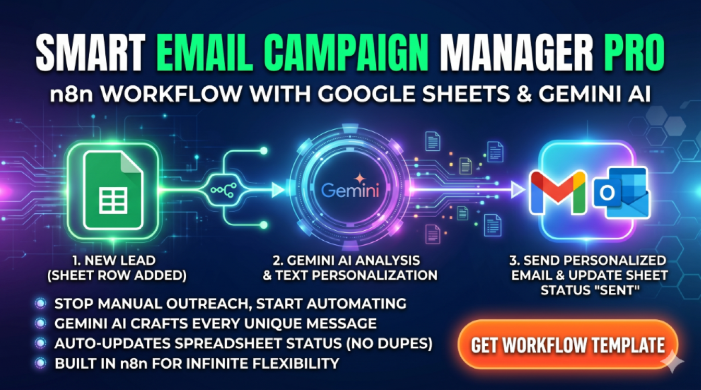

# 📨 Smart Email Broadcaster: Pro-Grade Outreach Engine

  

Stop paying for monthly email subscriptions. This n8n workflow transforms your **Google Sheets** into a powerful, private broadcasting system with zero limits.

---

### 🛠 System Architecture

> **The Power of Ownership**
> Why pay $50/mo for email services when you can run your own engine? Smart Email Broadcaster gives you 100% control over your data and your delivery.

---

### 🧠 Key Capabilities

* **Mass Outreach:** Broadcast messages to hundreds of contacts directly from your Google Sheet.
* **Auto-Scheduling:** The system autonomously checks for new entries every 5 minutes—set it and forget it.
* **Live Status Tracking:** Automatically marks contacts as "SENT" in your sheet once the email is delivered.
* **Safety Protocols:** Built-in batching logic to protect your sender reputation and prevent spam flags.

---

### ⚙️ Technical Stack
* **Engine:** n8n (Workflow Automation)
* **Data Source:** Google Sheets
* **Email Provider:** Gmail, Outlook, or any SMTP server
* **Logic:** Advanced JSON filtering and conditional routing

---

### 🚀 Implementation
This is a professional-grade JSON template for n8n.
* **Setup Time:** < 5 minutes.
* **Includes:** Fully configured nodes + Step-by-step Gmail/SMTP guide.

---

### 🛒 Get Full Access
Take control of your outreach today.

[**👉 Get Smart Email Broadcaster on Gumroad**](https://naroka.gumroad.com/l/email-broadcast-pro-n8n)

---
*Developed by [Naroka Studio](https://github.com/Naroka-Studio)*
